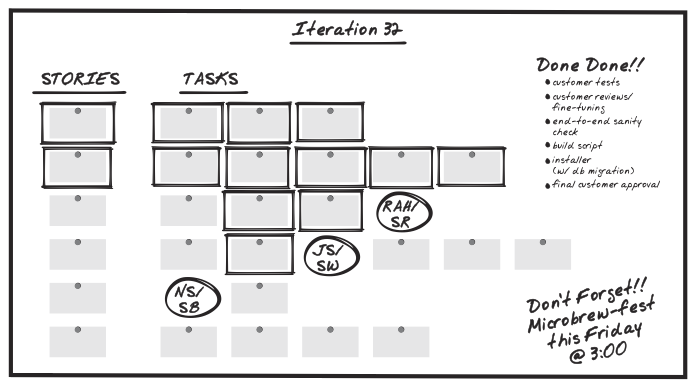

# Exception reports, or what happens when a project goes off-track

Wednesday 27 April 2016

One of the things that we’re taught when learning the DSDM agile project management framework is that, unlike traditional project management approaches where the project manager manages the team on a day-to-day basis, in DSDM the project manager manages by exception.

This post explains what that means.

## Project manager’s responsibility

In a PRINCE2 project “the project manager draws up the project plans that describe what the project team will actually be doing and when they expect to finish.” In other words they are concerned with both the big picture and the detail—the nitty-gritty.

By contrast, in a DSDM environment the nitty-gritty is the responsibility of the solution development team. In particular, the team leader’s role is to plan and coordinate the nitty-gritty, leading the team to break down the high-level requirements into tasks that can be worked on.

Which means that the project manager doesn’t have the same “command and control” approach as in a traditional project. In DSDM the project manager’s responsibility is for the big picture — the high-level planning — which is also done in collaboration with the rest of the team, and arranged into increments to be worked on during sprints/timeboxes.

_Each sprint, the stories (arranged into iterations by the project manager) are broken down into tasks by the team and team leader. (Image from James Shore’s book The Art of Agile Development, 2008)_

In short, the project manager takes the prioritised requirements list (the backlog of user stories and other requirements) and organises it into manageable chunks (timeboxes/sprints). Then each sprint, the team leader and the solution development team take the next batch of user stories and break them down into detailed tasks.

## Escalation… going up!

As the project manager doesn’t have the hands-on, day-to-day management of the solution development team there needs to be a clear escalation policy. Which is just a fancy project management way of saying: if there’s a problem then we need to know who to tell as quickly as possible so that it will get resolved and not hold up the project.

This supports at least five of the eight DSDM agile principles:

* Deliver on time
* Collaborate
* Never compromise quality
* Communicate continuously and clearly
* Demonstrate control

DSDM itself doesn’t define what an escalation process or report (DSDM calls these documents ‘products’) might look like. It leaves that up to each organisation, as not all projects will need them, and many organisations will already have their own.

Unlike other project management frameworks, DSDM only requires a document to be created if it adds value to the project. As the DSDM documentation says, “If documents genuinely help achieve this then create them, if not, don’t waste valuable time and effort doing so.” (DSDM products, section 8.3)

## Exception report

Our team has decided that an escalation report will add value to our project, so we’ve created one, called an ‘exception’ report. This is for those moments when we need to escalate things to the next level: from developer to team leader, from team leader to project manager, or from project manager to business sponsor.

After discussion with a friendly, neighbourhood business analyst, we decided to combine the three possible levels of escalation into the same document. This way information shouldn’t get lost if the report slowly works its way up the food chain.

In the report we first explain the current situation, what caused it, and the potential impact it may have if not addressed.

Then we identify alternative approaches to resolving the issue before identifying the team’s recommended approach from those outlined.

The rest of the report records the what-happens-next bit: the decisions made, how the issue was resolved and the impact fed back into the project: how it has affected the overall plan, budget and risk log.

## Conclusion

For me, understanding that the project manager manages by exception made much more sense with the inclusion of an exception report within our project documentation toolbox. It encourages me to remain hands-off, to not dabble or interfere with matters that are the responsibility of the team leader. It helps me to define and respect those boundaries.

So far on project DC1001 ‘External website redevelopments’, we’ve only needed to use this document once, to report to the business sponsors the knock-on effect that a change of priority has had on other deliverables.

Other level escalations have so far all been done verbally. But I expect that may change as we become more experienced in DSDM, and we find value in formally documenting certain issues.