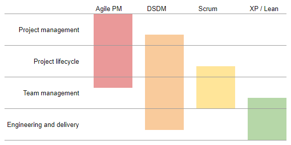

# Agile is a toolbox

Thursday 2 May 2019

While it's true to say we use the Scrum framework here at Vision, that's not the whole picture. As Bertrand Meyer says in _Agile! The Good, The Hype and the Ugly_ (Springer, 2014), "every agile team in the field makes up its own cocktail of agile practices, rejecting the ones that do not fit" (p.vii).

In terms of project lifecycle and team management practices, we are fully embracing Scrum. But Scrum has little or no opinion about engineering and delivery practices, which we complement largely with XP methodologies. The Scrum model assumes the development team will work with a product backlog but has no guidance on how that will be created—tools from AgilePM, DSDM or even PRINCE2 might be considered to supplement Scrum. (I've not been with Vision for long enough to fully understand how this is done here but that will come.)

Since I was introduced to it, I've always considered myself a proponent of agility rather than being partisan to any particular flavour or methodology: XP, Lean, Scrum, DSDM, Crystal, etc. 

## My agile journey

I was first introduced to agile through XP (extreme programming) having picked up a book at the 2008 Scotland on Rails conference in Edinburgh. (Memorably, that was the same day my then-wife learned we were expecting twins!) The keynote speaker spoke eloquently and persuasively about how agile approaches to software development had brought huge benefits to his team. I was hooked. I raced home, read the book from cover to cover and began to implement the ideas in my own team.

Then the university I was working for embraced Lean and I was introduced to its five principles, eight wastes, kaizen, kanban and a host of other useful concepts. I saw first-hand how empowering teams to own and change their processes reduced waste and improved productivity, effectiveness and team morale.

Latterly, it was decided that our team should embrace DSDM Atern. From a project management perspective, DSDM/AgilePM is the most complete. I have a terrific fondness for both its structure and flexibility.

## Agile toolbox

Beneath the umbrella term 'agile' we have a toolbox of practices. Some have been codified into highly defined systems like AgilePM, DSDM and Scrum, others like XP and Lean feel more like loosely-related methodologies grouped into adaptable frameworks.

Within each there is the freedom to mine other disciplines for best practices: business analysis techniques, MSP, P3O, traditional project management tools, etc.

Just as you wouldn't chastise a plumber for using a joiner's hammer, it makes no sense to prevent an agile team from using a technique from another discipline if it does the job.

None of the frameworks cover everything. It makes perfect sense to supplement them with tools from elsewhere. DSDM makes that explicit: "for most organisations, DSDM is all that is needed," the handbook proclaims, "although some gain value from integrating DSDM with project management methods such as PRINCE2 and PMI, or detailed development techniques, such as extreme programming (XP)."

This is one of the most helpful diagrams I've found that demonstrates the relationship between agile methodologies and how they complement one another:

Image credit: _Agile Project Management in Easy Steps_ by John Carroll (2012)

Over the next few weeks, I expect my blog posts to focus on aspects of both Scrum and XP in particular, exploring in more depth some of the tools we have access to in our agile toolbox.