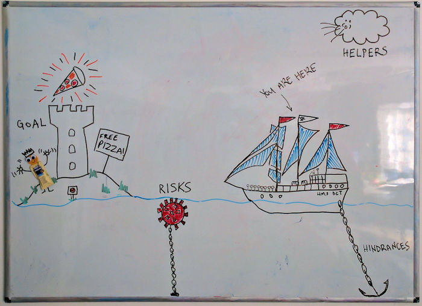

# Retrospective idea: Sailboat

Thursday 28 November 2019

The sailboat retrospective is a model that I especially like to use at the end of significant chunks of work, like a release or the end of an epic or the end of a project. But it could be used at any time, especially if there is a need to better understand project objectives, risks, hindrances and helpers.

I like to use this model for post release retrospectives because it helps the team to focus on lessons learned around unexpected risks, the things that slowed the team down and celebrate the things had really helped us.

Luis Gonçalves in _Getting Value out of Agile Retrospectives_ by Luis Gonçalves and Ben Linders (InfoQ, 2015) reports that he has used this model successfully with two interdependent teams who needed to solve ongoing issues.

This might also be a useful model for a session at the start of a project to help anticipate potential hazards and helpers.

## Setup

On a large piece of paper or a whiteboard draw an island with a sailing ship heading towards it. The ship must have an anchor dragging along the sea bed. Above and behind the ship draw a cloud (or clouds) whose winds are propelling it forward. Then between the ship and the island draw either rocks or a naval mine.

That's all; you don't have to be a great artist to do this; copy images from a Google image search if you need to. If you do have a bit of an artistic flair, be creative — customise the image for your team, make it personal.

The ship represents your team; the anchor represents whatever has slowed down your team, the hindrances.

The island represents the goal of your iteration/milestone/project.

The clouds represent the helpers, what speeded you up?

The rocks/sea mine represent the risks that threatened the success of your project.

## How to run the retrospective

First, make sure the whole team understands what the goals of the iteration/milestone/project were. Write these down on a Post-it note and stick it to the diagram.

Armed with Sharpies and Post-it notes, invite the team to brainstorm their ideas under the remaining three headings: helpers, risks and hindrances. Given them about 10 minutes, then read through all the Post-it notes so everyone knows what has been written. This may inspire a further idea or two which may be added to the board.

Next, discuss with the team the ideas presented for each of the three areas in the order helpers, risks and hindrances. 

Helpers: first celebrate the good stuff. How can the team continue these good practices? Where do they need to write these down so they remember them? Maybe they need to update a team handbook or definitions of ready or done. Also, whom does the team need to contact to thank for their help during this project? A simple thank you doesn't take long but 

Risks: next discuss the risks. How can the team mitigate these in the future? Do they need to be added to a formal risk register?

Hindrances: finally, discuss what has been slowing the team down. You may wish to identify the most important one (use dot voting if there is no consensus) to provide some focus. This discussion should result in a plan to fix the issue identified.

With a list of people to thank, risks to record and an action plan to solve at least one of the hindrances, the retrospective should be closed.